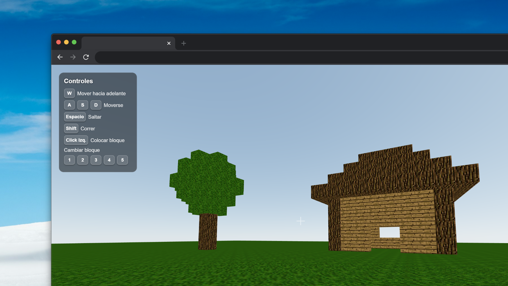

<h1 align="center">🎮 Minecraft Clone with React Three Fiber</h1>
<p align="center">Un clon de Minecraft desarrollado con React, Three.js y React Three Fiber que permite construir y explorar mundos 3D en tiempo real.</p>

<p align="center">
  <a href="https://reactjs.org"></a>
  <a href="https://typescriptlang.org"></a>
  <a href="https://threejs.org"></a>
  <a href="https://github.com/pmndrs/zustand"></a>
  <a href="https://vitejs.dev"></a>
</p>

<p align="center">
  <a href="https://minecraft-vite.vercel.app">🌐 Live Demo</a> •
  <a href="#-installation">⚙️ Installation</a> •
  <a href="#-features">✨ Features</a> •
  <a href="#-tech-stack">📦 Tech Stack</a>
</p>

---

## 📸 Demo

 <!-- Replace with GIF or video if available -->

> Try the live version: [minecraft-vite.vercel.app](https://minecraft-vite.vercel.app)

---

### 📦 Tech Stack

| Technology        | Description                          |
|------------------|--------------------------------------|
|  | Frontend library |
|  | Static typing |
|  | 3D graphics library |
|  | React renderer for Three.js |
|  | Physics engine |
|  | Global state management |
|  | Frontend build tool |

---

### ✨ Features

- 🌍 Mundo 3D interactivo con física realista
- 🧱 Construcción de bloques con múltiples texturas
- 🎮 Controles de primera persona (WASD + Espacio)
- 🎨 5 tipos de texturas diferentes (tierra, hierba, vidrio, madera, tronco)
- ⚡ Cambio de texturas con teclas numéricas (1-5)
- 🖱️ Colocación y eliminación de cubos con mouse
- 🎯 Interfaz intuitiva con indicador de textura actual
- 🚀 Rendimiento optimizado con React Three Fiber

---

### 🎯 Learnings & Challenges

- [x] Integré React Three Fiber con Cannon.js para física realista
- [x] Implementé sistema de gestión de estado con Zustand
- [x] Desarrollé controles de primera persona con PointerLockControls
- [x] Creé sistema de texturas dinámicas con Three.js TextureLoader
- [x] Optimicé rendimiento con useFrame y gestión eficiente de eventos
- [x] Implementé sistema de construcción/eliminación de cubos interactivo

---

### ⚙️ Installation

```bash
# Clone the repository
git clone https://github.com/JeremyAyza/minecraft-vite.git
cd minecraft-vite

# Install dependencies
pnpm install

# Start development server
pnpm dev
```

---

## 🎮 Usage

### Game Controls

#### Movement
- **W** - Move forward
- **S** - Move backward  
- **A** - Move left
- **D** - Move right
- **Space** - Jump

#### Building
- **Left Click** - Place block
- **Alt + Left Click** - Remove block
- **1-5** - Change texture type:
  - **1** - Dirt
  - **2** - Grass
  - **3** - Glass
  - **4** - Wood
  - **5** - Log

### Interface
- **Texture Indicator**: Shows currently selected texture in top-left corner
- **Crosshair**: Center cross for aiming

---

## 🏗️ Project Structure

```
src/
├── components/          # React components
│   ├── Cube.tsx        # Individual cube component
│   ├── Cubes.tsx       # All cubes rendering
│   ├── FVP.tsx         # First-person controls
│   ├── Ground.tsx      # World surface
│   └── Player.tsx      # Player and physics
├── hooks/              # Custom hooks
│   ├── useKeyboard.ts  # Keyboard event handling
│   └── useStore.ts     # Global state with Zustand
├── lib/                # Utilities and configurations
│   └── textures.ts     # Texture loading and setup
├── helpers/            # Helper functions
│   └── images.ts       # Image imports
├── types/              # TypeScript type definitions
│   └── ActionsKeboardMap.ts  # Key mapping
└── assets/             # Static resources
    └── images/         # Block textures
```

---

## 🔧 Available Scripts

```bash
# Development
pnpm dev          # Start development server

# Build
pnpm build        # Build for production
pnpm preview      # Preview build

# Code Quality
pnpm lint         # Run ESLint
```

---

## 🎨 Customization

### Adding New Textures

1. **Add image** in `src/assets/images/`
2. **Import image** in `src/helpers/images.ts`
3. **Create texture** in `src/lib/textures.ts`
4. **Add mapping** in `src/types/ActionsKeboardMap.ts`
5. **Update hook** in `src/hooks/useKeyboard.ts`

### Modifying Physics

Physics parameters can be adjusted in:
- `src/components/Player.tsx` - Player speed and jump
- `src/components/Cube.tsx` - Cube properties
- `src/components/Ground.tsx` - World surface

---

## 🤝 Contributing

Contributions are welcome. Please:

1. Fork the project
2. Create a feature branch (`git checkout -b feature/AmazingFeature`)
3. Commit your changes (`git commit -m 'Add some AmazingFeature'`)
4. Push to the branch (`git push origin feature/AmazingFeature`)
5. Open a Pull Request

---

## 📝 License

This project is under the MIT License. See the `LICENSE` file for more details.

---

## 👨‍💻 Author

**Jeremy Ayza**
- GitHub: [@JeremyAyza](https://github.com/JeremyAyza)

---

## 🙏 Acknowledgments

- [React Three Fiber](https://github.com/pmndrs/react-three-fiber) - For making Three.js accessible in React
- [React Three Drei](https://github.com/pmndrs/drei) - For utilities and helpers
- [Cannon.js](https://github.com/schteppe/cannon.js) - For physics engine
- [Zustand](https://github.com/pmndrs/zustand) - For state management

---

⭐ If you like this project, don't forget to give it a star!
